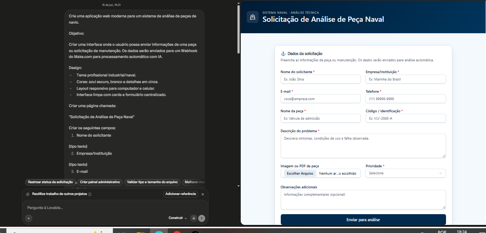
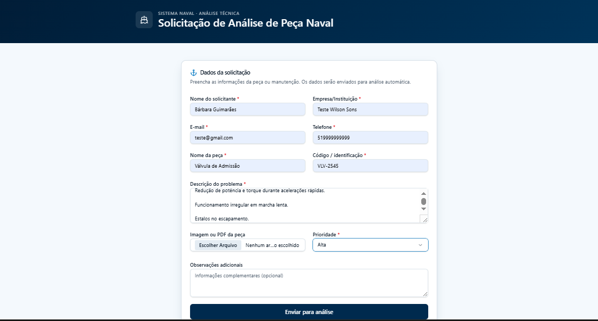
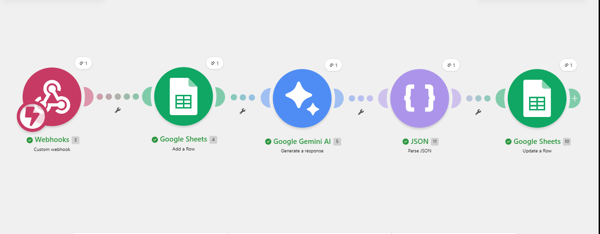
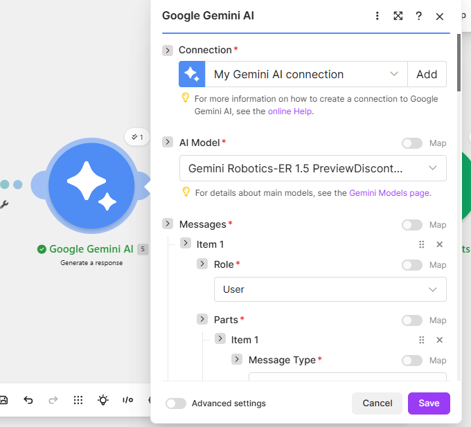
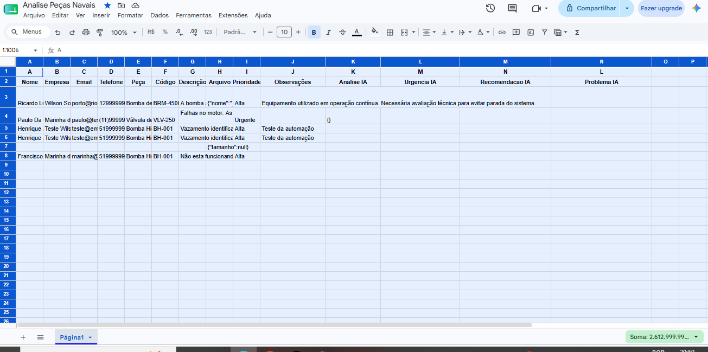

                        🚢 Sistema Inteligente de Análise de Dados Técnicos Navais com IA

📖 Visão Geral

Este projeto tem como objetivo automatizar a análise de informações técnicas relacionadas a componentes navais utilizando Inteligência Artificial.

A solução foi desenvolvida para reduzir atividades manuais de interpretação de dados técnicos, permitindo que informações enviadas pelo usuário sejam processadas automaticamente, analisadas por IA e organizadas para consulta da equipe responsável.

A aplicação integra Lovable, Make.com, Google Gemini AI e Google Sheets, criando um fluxo automatizado de recebimento, análise e armazenamento das informações.

🎯 Objetivo do Projeto

Automatizar o processo de análise de dados técnicos de peças e componentes navais, auxiliando na identificação de materiais, organização das informações e apoio à tomada de decisão.

❗ Problema Identificado

Atualmente, a análise de documentos e informações técnicas pode exigir grande esforço manual da equipe, tornando o processo mais demorado e sujeito a erros.

Principais dificuldades:

Análise manual de informações técnicas;
Dificuldade em organizar os dados recebidos;
Maior tempo para identificação de materiais necessários;
Falta de histórico centralizado das análises realizadas.

✅ Solução Desenvolvida

Foi criada uma aplicação web integrada a uma automação inteligente capaz de:

Receber informações técnicas através de formulário;
Enviar os dados automaticamente para processamento;
Utilizar Inteligência Artificial para análise;
Gerar respostas estruturadas;
Registrar os resultados automaticamente em uma planilha.

🖥 Interface da Aplicação

A interface foi desenvolvida utilizando Lovable, permitindo que o usuário informe os dados necessários para análise.

Figura 1 – Tela principal do sistema desenvolvido no Lovable.

Campos utilizados:
Nome;
Empresa;
E-mail;
Telefone;
Nome da peça/material;
Código;
Descrição técnica;
Prioridade;
Observações.

Figura 2 – Exemplo de preenchimento da solicitação técnica.

⚙ Arquitetura da Solução

Usuário
   |
   ↓
Lovable (Formulário Web)
   |
   ↓
Webhook Make.com
   |
   ↓
Google Gemini AI
   |
   ↓
Tratamento da resposta JSON
   |
   ↓
Google Sheets
   |
   ↓
Resultado da análise técnica

Figura 3 – Cenário de automação criado no Make.com.

🔄 Funcionamento da Automação

1. Recebimento dos dados

O usuário preenche o formulário desenvolvido no Lovable.

As informações são enviadas para um Webhook criado no Make.com.

2. Processamento no Make.com

O Make.com é responsável por controlar todo o fluxo da automação.

Funções:

Receber os dados;
Enviar informações para a Inteligência Artificial;
Organizar o retorno;
Atualizar os registros.

3. Análise utilizando Google Gemini AI

 
    Figura 4 – Processamento dos dados utilizando Inteligência Artificial. 

Gemini realiza uma análise automática dos dados técnicos enviados.

A IA pode:

Interpretar a descrição técnica;
Identificar possíveis materiais;
Organizar informações;
Classificar prioridade;
Gerar recomendações.
4. Registro dos resultados

Após a análise, os dados são enviados para o Google Sheets.

A planilha mantém:

Dados do solicitante;
Informações da peça;
Resultado da IA;
Observações técnicas.

📊 Estrutura dos Dados

Campo	Descrição
Nome	Usuário solicitante
Empresa	Empresa responsável
E-mail	Contato
Peça	Nome do componente
Código	Identificação técnica
Descrição	Informações enviadas
Prioridade	Nível de urgência
Análise IA	Resultado gerado pela IA
Recomendação	Sugestão técnica

Figura 5 – Dados analisados e registrados automaticamente na planilha.

🛠 Tecnologias Utilizadas

Tecnologia	Função
Lovable	Desenvolvimento da interface web
Make.com	Automação do processo
Google Gemini AI	Análise inteligente dos dados
Google Sheets	Armazenamento dos resultados
Webhook	Comunicação entre sistemas
JSON	Organização das respostas

🚀 Como Utilizar

Acessar o link da aplicação;
Preencher o formulário com as informações técnicas;
Enviar a solicitação;
A automação será executada automaticamente;
A IA realizará a análise;
O resultado ficará registrado no Google Sheets.

🌟 Benefícios da Solução

Redução do trabalho manual;
Maior velocidade na análise;
Padronização das informações;
Histórico centralizado;
Aplicação de Inteligência Artificial em processos técnicos;
Apoio à equipe na tomada de decisão.

🔮 Melhorias Futuras

Leitura automática de desenhos técnicos em PDF;
Extração automática de lista de materiais (BOM);
Comparação entre desenho técnico e Job Book;
Alertas automáticos para equipes responsáveis;
Dashboard de acompanhamento.

👩‍💻 Desenvolvido por

Greice Lima Rocha

Projeto desenvolvido como solução de automação utilizando ferramentas Low-Code e Inteligência Artificial.
